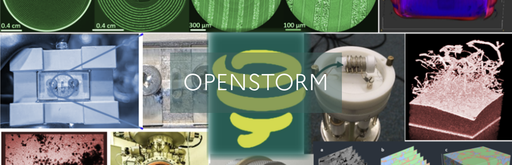
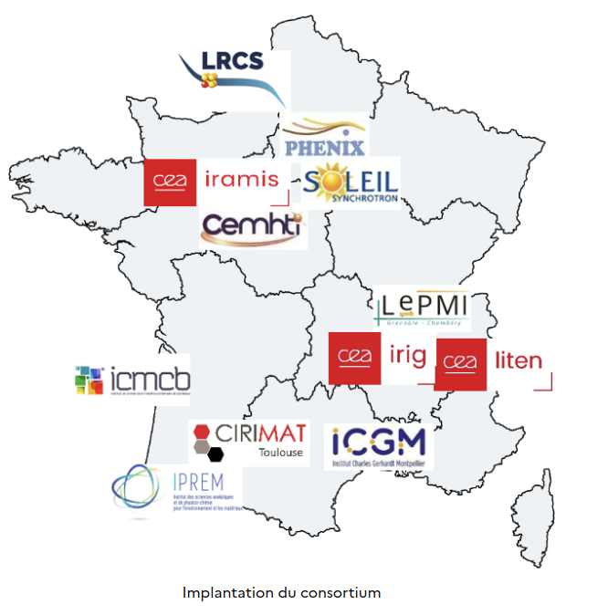

<p align="center">
  
</p>

# PEPR Batteries – **OPENSTORM**

> *Caractérisation operando des matériaux pour le stockage de l’énergie : 
> Du laboratoire aux grands instruments*

---

## About OPENSTORM

**OPENSTORM** is a French national project funded by the **PEPR Batteries – France 2030** programme.  
Led by Dr Sandrine Lyonnard (CEA-IRIG, Grenoble) and Prof Lorenzo Stievano (ICGM, Montpellier), the project is building an **open, multi-technique, multi-modal _operando_ characterisation platform** that probes how next-generation batteries operate **and** degrade in real time.  
By integrating novel diffraction, imaging and spectroscopy methods, the platform correlates structural, chemical and electrochemical information across active materials, cell components (electrodes, electrolytes, current collectors) and their interfaces—accelerating our understanding of the mechanisms that govern battery performance and durability.


| Key ideas                 | What it means                                                                                                        |
| ------------------------- |----------------------------------------------------------------------------------------------------------------------|
| **Multimodal, multi-technique** | Electrical (V, I), X-ray diffraction, nano-CT, spectroscopy …                                                        |
| **Correlative & multi-scale** | Align data across length scales and components (materials ↔ electrodes ↔ interfaces) for analysis   |
| **Open, FAIR & AI**       | Standard metadata schema, open-source pipelines, deep-learning models  |

Official webpage → <https://www.pepr-batteries.fr/projet/openstorm/>

---

## Research Axes

|       | Axis | Key questions & methods |
|-------|------|-------------------------|
| **1** | **Probe the structure of battery materials** | Operando X-ray / neutron diffraction, small-angle scattering & micro-diffraction down to single particles; ad-hoc cells with temperature- and pressure-control |
| **2** | **Decode microstructure & morphology** | High-resolution ( < 100 nm) 2D/3D imaging & tomography to map concentration heterogeneities and identify chemical phases during cycling |
| **3** | **Study local properties & charge-transfer** | Combined bulk & surface spectroscopies to relate electronic structure, transport and interfacial kinetics – incl. thin-film model systems |
| **4** | **Holistic, correlative view** | Standardised, multi-parameter, multi-scale database plus generic, lab-to-lab tools for cross-technique correlations and accelerated analytics |

---

## Research Goals

- **Nation-wide characterisation platform** – build an open portfolio of diffraction, spectroscopy and imaging techniques that spans laboratory instruments **and** large-scale facilities (synchrotron, neutron).  
- **Next-generation chemistries** – transfer 20 years of Li-ion know-how and extend it to solid-state, high-power and post-Li-ion batteries.  
- **Real-time mechanistic insight** – couple operando spectroscopy, scattering/diffusion and electrochemistry to track reaction mechanisms and degradation as they occur.  
- **Ad-hoc cells & standardised data** – design temperature/pressure-controlled electrochemical cells and a FAIR, multi-technique data schema to enable cross-lab correlations.  
- **Safer, higher-performance batteries** – accelerate the development of materials and technologies with improved safety and performance, reducing environmental impact.  
- **Skills training** – supervise **12 PhD/post-doctoral fellows** and disseminate the resulting expertise to the battery community.  


---

## Consortium

| Labs / Facilities | Location (France) |
|-------------------|-------------------|
| **CEA-IRIG**, **CEA-LITEN** | Grenoble |
| **CEA-IRAMIS** | Saclay |
| **LRCS**, **PHENIX**, **CEMHTI** | Amiens, Paris, Orléans |
| **ICGM**, **CIRIMAT**, **ICMCB** | Montpellier, Toulouse, Bordeaux |
| **LEPMI**, **IPREM** | Grenoble, Pau |
| Large instrument – **SOLEIL** (synchrotron) | Gif-sur-Yvette |

> 8 academic labs, 3 CEA institutes, and the SOLEIL synchrotron join forces to span electrochemistry ↔ physics ↔ data science.

<p align="center">
  
  <br/>
  <em>Figure – Geographical distribution of the OPENSTORM consortium.</em>
</p>


---

## Data Availability

| Dataset                | Format | Access |
|------------------------|--------|--------|


---

## Citation

If you use **OPENSTORM** software or data, please cite:

```bibtex
@misc{openstorm,
  author       = {the OPENSTORM Consortium},
  title        = {{OPENSTORM}: Operando Characterisation Platform for Next-Gen Batteries},
  year         = 2024,
  howpublished = {\url{https://github.com/PEPR-Batteries-OpenStorm/PEPR_Batteries_OpenStorm}},
  note         = {PEPR Batteries – France 2030}
}
```


---

## Acknowledgements

Project coordinated by **CEA-IRIG** (Grenoble) and **ICGM** (Montpellier),  
with the contribution of **8 academic laboratories**, **3 CEA institutes**  
and the **SOLEIL** synchrotron.  
Funded by the French Government under the **France 2030** programme.
